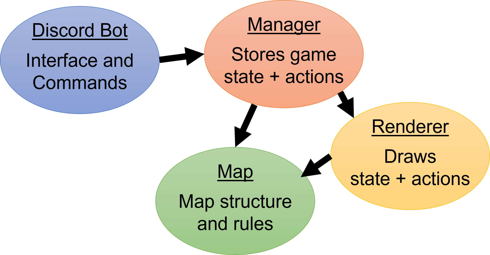

# Digital Diplomat

This repo contains a suite of python scripts for creating, managing, and visualizing [Diplomacy](https://en.wikipedia.org/wiki/Diplomacy_(game)) games. The scripts herein are designed to bridge the gap between the mechanics of the game (the adjudicator used here is [`pydip`](https://github.com/aparkins/pydip)) and a user facing interface to play the game.

The primary use case here is for groups that play Diplomacy over the internet managed by a moderator or even automatically be a discord bot.


## Setup guide

The recommended way to use this repo is with a discord bot (run locally). This bot provides and interface for the game directly in discord using a handful of commands (run `.help` in discord to see a full list of available commands).


### Installation

0. If you don't already have python installed, I recommend using the [Anaconda](https://www.anaconda.com/products/individual) (or [miniconda](https://docs.conda.io/en/latest/miniconda.html)) distribution, as it will make dealing with dependencies easier.

1. Download, or better yet, clone this repo with `git clone https://github.com/felixludos/digi-diplo`. 

2. From the top level directory (containing this readme), install all dependencies using `pip install -r requirements.txt`.

3. Test to make sure everything is installed and working by running: `fig start-bot`. This should produce an error saying `No discord token found` (assuming you haven't already setup the discord bot). If there is a different error, chances are you are missing a dependency and try installing it based on the error message using `pip install [name]`

4. Now create and add a discord bot to the discord guild (aka. server) of your choice. Here's a useful tutorial to do so: [How to Make a Discord Bot in Python](https://realpython.com/how-to-make-a-discord-bot-python/)

5. Once you have the necessary discord token, make sure it is stored as an environment variable called `DISCORD_TOKEN`.

6. Finally, rerun `fig start-bot`, this time there should be no error, and after some loading, the last line in the console should say something along the lines of `Logged on as [bot-name]`.

7. You can confirm that the bot is ready for use by submitting `.ping` on a public channel in the discord guild, and the bot should greet you. Once you get this far, the setup is complete, and now it's only a matter of configuring the bot to behave as you wish (e.g. run the variant you want to play).

8. Lastly, it is strongly recommended create a discord role for all the game managers, as only they should be allowed to run certain commands on the bot (e.g. adjudicating the current season). For the purposes of this guide, the role will be called "Host", but you can use any role by replacing "Host" where necessary in the commands below.

### Starting a Game

If you just want to start playing the vanilla Diplomacy, you can start the bot with the following command:

```bash

fig start-bot classic/bot --admin-role Host

```

This will start the bot and will automatically create a new game and store all the corresponding files in `games/`. If you want to load an existing game (e.g. `games/game1`) instead of starting one from scratch when starting the bot, use the command:

```bash

fig start-bot classic/bot --admin-role Host --game-root games/game1

```

While the bot is running, you can submit the message `.help` to see a list of all the commands the bot can respond to. 

[More detailed documentation coming soon]
 
## Customizing the Bot/Game



dd
The bot can be started with the `start-bot` command, and must be provided a manager (e.g. `diplo-manager`) which will keep track of the game state and actions. The manager keeps track of the map (see the `diplo-map` component) and optionally a renderer which can draw the current game state and/or submitted orders (see the `diplo-renderer`).


## Creating maps/variants

[guide coming soon (for now, see the `notebooks/` directory)]

